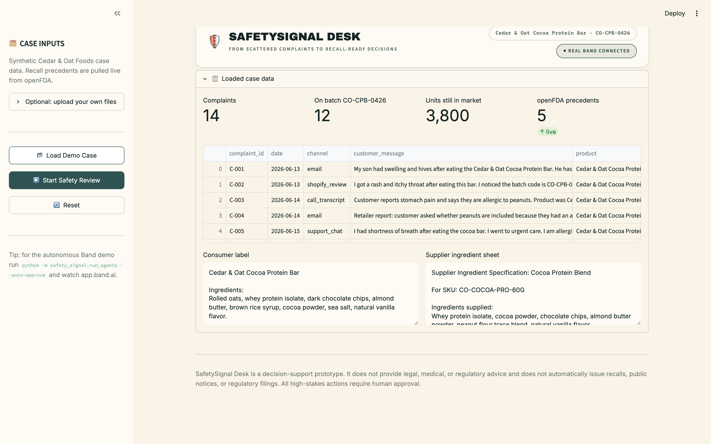
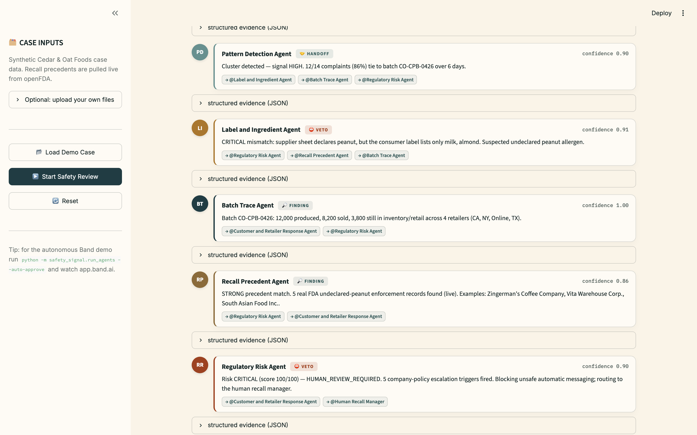
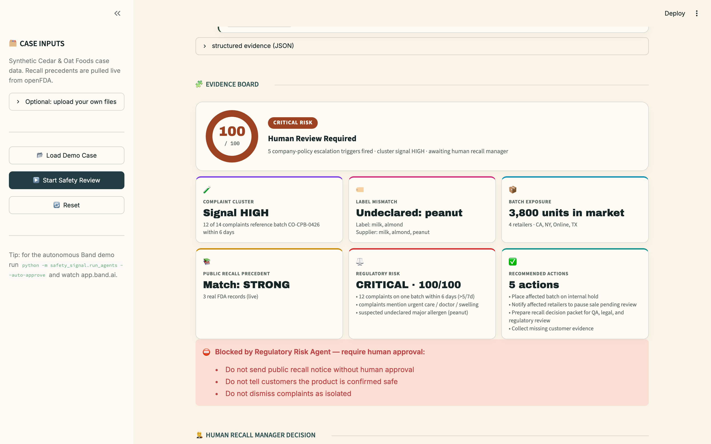
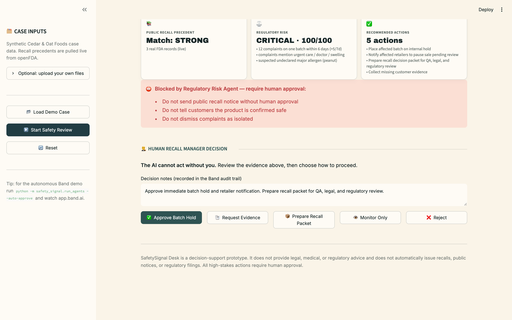
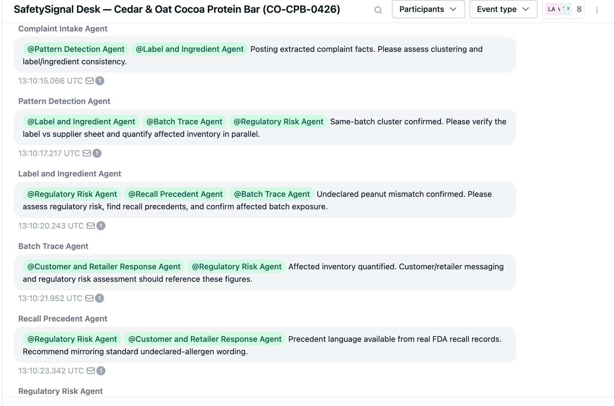
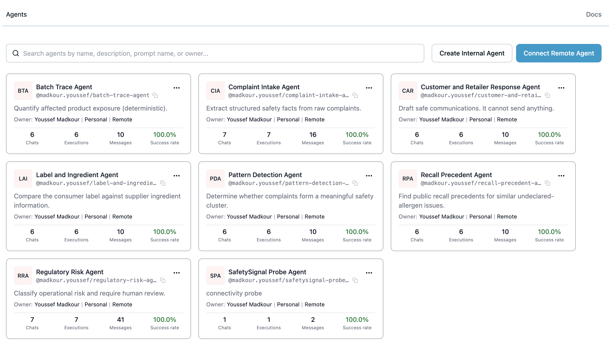

# 🛡️ SafetySignal Desk

**From scattered complaints to recall-ready decisions.**

SafetySignal Desk is a Band-powered product safety review room where specialist
AI agents analyze customer complaints, product labels, supplier ingredient
sheets, batch records, public recall precedents, and company escalation policy,
then prepare an **audit-ready safety decision packet** for a **human recall
manager**. The AI never issues a recall on its own — it assembles the evidence
and requires human approval.

> Tracks: **Regulated & High-Stakes Workflows** (primary), **Internal Enterprise
> Workflows** (secondary).



---

## Problem

Consumer-product safety teams receive complaints from many disconnected sources:
email, support tickets, marketplace reviews, retailer reports, call transcripts,
plus internal labels, supplier specs, and batch distribution records, and
external public recall databases. The hard part isn't reading one complaint —
it's recognizing when scattered signals have quietly become a **recall-level
safety issue** that needs escalation. That recognition is slow, manual, and
easy to miss until it's a crisis.

## Solution

SafetySignal Desk opens a **real Band investigation room** and drops seven
specialist agents into it. Each agent contributes one piece of the picture and
hands off to the next via @mentions. A Regulatory Risk agent scores the case,
blocks unsafe automatic messaging, and escalates to a human recall manager, who
approves or rejects the recommended action. The output is a single audit-ready
**Safety Decision Packet** plus the full Band transcript as the audit trail.

## Demo Scenario

A fictional food brand (**Cedar & Oat Foods**) receives **14 complaints in 5
days** about its **Cocoa Protein Bar, batch CO-CPB-0426**. Several complaints mention peanut
allergy and allergic reactions, two mention urgent care — but the **consumer
label does not list peanuts**. The **supplier ingredient sheet** shows peanut
flour / peanut cross-contact on the production line. **3,800 units** remain in
inventory and retailer channels.

The system detects the cluster, finds the undeclared-peanut mismatch, quantifies
exposure, compares **real FDA recall precedents**, scores the case **CRITICAL**,
blocks unsafe messaging, and escalates to the human recall manager.

## Walkthrough

**1. The agents coordinate in a real Band room** — each posts a structured finding and @mentions the next specialist.



**2. Everything converges on the Evidence Board** — a deterministic CRITICAL 100/100, with every tile backed by a finding, and unsafe actions blocked.



**3. A human recall manager makes the call** — the AI prepares the recommended actions but cannot act without approval.



### This is really Band, not a simulation

The same run is visible in the Band web app — every agent is a registered Band participant, and the handoffs are real `@mention` messages in one shared room.





> 🎬 A full narrated walkthrough is in [`demo/safetysignal_demo.mp4`](demo/safetysignal_demo.mp4).

## Agent Architecture

Coordination happens in a real Band room. Each agent posts a **structured JSON
finding** (a Band event) and an **@mention handoff** (a Band message).

| # | Agent | Brain | Posts → mentions |
|---|-------|-------|------------------|
| 1 | Complaint Intake | LLM + deterministic | facts → Pattern Detection, Label & Ingredient |
| 2 | Pattern Detection | deterministic | cluster → Label & Ingredient, **Batch Trace** (parallel branch), Regulatory Risk |
| 3 | Label & Ingredient | LLM + deterministic | undeclared-peanut mismatch → Regulatory Risk, Recall Precedent, Batch Trace |
| 4 | Batch Trace | **deterministic only** (no LLM math) | exposure → Customer Response, Regulatory Risk |
| 5 | Recall Precedent | **real openFDA** + LLM phrasing | precedents → Regulatory Risk, Customer Response |
| 6 | Regulatory Risk | deterministic scoring + policy | **CRITICAL + blocked actions** → Customer Response, **Human Recall Manager** |
| 7 | Customer & Retailer Response | LLM + deterministic | DRAFT comms (not approved) → Human Recall Manager |
| — | **Human Recall Manager** | **you** | approve / reject — captured in Band |

**Hybrid brains:** arithmetic, scoring, batch exposure, and the
undeclared-allergen detection are deterministic Python (stable, auditable and
never model-generated); language-heavy work — complaint extraction, label
reasoning, precedent summarization, the risk rationale, and the draft comms —
uses an OpenAI-compatible LLM (we run `gpt-5.4-mini`) with a deterministic
fallback so the demo never depends on the network. The LLM can phrase a finding
but can never move a number or a decision; every finding is tagged
`reasoning_mode: llm | deterministic`, and `python -m scripts.selftest` asserts
that invariant end-to-end.

## Why Band Is Essential

Band is the **coordination layer and the audit trail**, not a chat widget:

- All 7 agents **join one real Band room** and post into it with their own agent
  API keys.
- **Handoffs are real Band @mentions** — Band only delivers a message to the
  agents it mentions, so the mention graph *is* the workflow.
- **Structured findings are posted as Band events** (tool_result / thought),
  giving an audit-grade record separate from the human-readable handoff text.
- A **parallel branch** (Label & Ingredient + Batch Trace) is fanned out from a
  single Pattern Detection multi-mention.
- The Regulatory Risk agent **blocks unsafe actions** and **escalates to the
  human** (@mentions the recall manager, who is a real participant in the room).
- The **Band transcript is the audit trail** exported with the decision packet.

**Two coordination modes (both real Band, Agent API):**

1. **Event-driven (`safety_signal/run_agents.py`)** — the headline mode. Each
   agent runs as a live **Phoenix-Channels WebSocket** listener. Nothing in
   Python sequences them: when Band delivers a message that @mentions an agent,
   that agent wakes, reads the upstream findings carried in the message
   (**context-through-Band** — each handoff embeds the sender's structured JSON),
   checks its prerequisites, and posts its own finding + handoff. The Regulatory
   Risk agent is @mentioned by several agents and **converges** — it runs only
   once label + batch + recall findings have all arrived in the room. Remove Band
   and the workflow cannot proceed; coordination, context, and convergence all
   flow through Band.
2. **Sequenced (`safety_signal/orchestrator.py`, used by the Streamlit UI)** — a
   reliable demo path that runs the agents in order, still posting every finding
   and @mention handoff into the real room. Used as the human-facing console and
   as a fallback if live sockets misbehave on stage.

Agents are registered once via the Human API (`POST /me/agents/register`); all
runtime traffic is Agent API. The human recall manager makes the decision in the
console — but because the **Human API messaging endpoints require an Enterprise
plan** (the account is on Pro), the decision is **relayed into the room via the
agent gateway** (a `human_action` event attributed to the recall manager) so it
is captured in the transcript. See `band_client.py`, `event_runtime.py`,
`orchestrator.py`.

## Data Sources

| Data | Real or synthetic? | Source |
|------|-------------------|--------|
| Complaints, label, supplier sheet, batch inventory, policy | **Synthetic** | `data/demo_case/` — real pre-recall company data is private |
| Recall precedents | **Real** | openFDA Food Enforcement API (`reason_for_recall:"undeclared peanut"`), cached after first live fetch |

> The Cedar & Oat Foods incident is fictional demo data. **The recall precedents
> are real FDA records pulled live from openFDA.**

### Fictional Brand Safety Note

All internal case data is fictional. The company (**Cedar & Oat Foods**), product
(**Cocoa Protein Bar**), batch (**CO-CPB-0426**), SKU (**CO-COCOA-PRO-60G**),
retailers (**Northstar Market, FitCart Online, HarvestLane Stores, WellBasket
Retail**), and all customers are invented and do not reference any real company.
No real brand, retailer, customer, or company identifiers appear in the demo case.

Real public data is used **only** for external recall precedents (openFDA Food
Enforcement). The demo clearly distinguishes fictional internal incident data
from real public FDA recall precedent data.

## How to Run Locally

```bash
python3 -m venv .venv && source .venv/bin/activate
pip install -r requirements.txt
cp .env.example .env            # fill in keys (see below)

# One-time: register the 7 agents on Band (writes agents.json)
python -m scripts.register_agents

# Optional: refresh the real openFDA precedent cache
python -m scripts.fetch_openfda

# Mode A — autonomous, event-driven over Band WebSockets (the headline demo).
# Watch the room fill in real time at app.band.ai while this runs.
python -m safety_signal.run_agents --auto-approve

# Mode B — human-facing Streamlit console (sequenced, reliable).
streamlit run app.py
```

For the Streamlit console: **Load Demo Case → Start Safety Review → Approve Batch
Hold → Export**. For the autonomous demo, open the room printed by
`run_agents` in the Band web app to show agents handing off live.

> Without `BAND_API_KEY` + a registered `agents.json`, the app runs in **local
> preview mode**: the full agent pipeline and evidence board work, but nothing
> is posted to Band. Add the credentials to get the real Band room.

## Environment Variables

See `.env.example`. Key ones:

- `LLM_PROVIDER` — `aiml` | `openai` | `gemini` (all OpenAI-compatible). Set the matching key: `AIML_API_KEY`, `OPENAI_API_KEY`, or `GEMINI_API_KEY` (each with an optional `*_MODEL`). Optional `LLM_API_KEY`/`LLM_BASE_URL`/`LLM_MODEL` hard-override for any other OpenAI-compatible endpoint. All optional — agents fall back to deterministic output if blank.
- `BAND_API_KEY` — your human/owner key. `BAND_API_BASE_URL`, `BAND_WS_URL`.
- `BAND_OWNER_USER_ID` — your Band user UUID, so agents can @mention the human recall manager.
- `BAND_AGENT_KEYS_FILE` — where `register_agents.py` stores the 7 agent ids + keys (default `agents.json`).
- `USE_CACHED_PUBLIC_DATA` — cache used only as a fallback after a live openFDA fetch.

## Demo Script

> Consumer brands receive safety signals across tickets, labels, supplier
> sheets, batch records, and public recall databases. The problem is not reading
> one complaint — it's knowing when scattered complaints become a recall-level
> signal.
>
> In this fictional internal case, Cedar & Oat Foods receives 14 complaints over
> five days about its Cocoa Protein Bar, batch CO-CPB-0426. Several mention peanut
> allergy, but the consumer label doesn't list peanuts. The internal case is
> synthetic, but the recall precedents are real FDA records pulled from openFDA.
>
> SafetySignal Desk opens a Band-powered review room. The Complaint Agent
> extracts symptoms. The Pattern Agent detects same-batch clustering. The Label
> Agent finds the peanut mismatch. The Batch Agent traces affected units. The
> Recall Precedent Agent finds **real FDA** recall language. The Regulatory Risk
> Agent blocks unsafe customer messaging and escalates to a human.
>
> The AI does not recall the product by itself. It prepares an evidence-backed
> decision packet and requires a human recall manager to approve the next action.
> The human approves a batch hold, and SafetySignal Desk generates an
> audit-ready packet with findings, recommended actions, blocked actions, draft
> notices, the human decision, and the full Band audit trail.

## Judging-Criteria Mapping

- **Band is the actual collaboration layer (not a wrapper)** → in event-driven mode, agents are *triggered* by Band WebSocket delivery, *read upstream context* from the Band messages they receive, and *converge* (Regulatory Risk waits for all prerequisites to arrive in the room). Unplug Band and the workflow stops.
- **Multi-agent coordination via Band** → 7 agents in one real room, @mention handoffs, structured events, a concurrent fan-out branch (Label ∥ Batch Trace), a veto/block, and human approval — all in the transcript.
- **Regulated / high-stakes fit** → human-in-the-loop gate; AI cannot issue recalls; explicit blocked actions; operational-only disclaimer.
- **Real data** → live openFDA Food Enforcement precedents.
- **Polish / completeness** → single-page console, evidence board, exportable decision packet (.md) + audit trail (.json).

## Safety Disclaimer

> SafetySignal Desk is a decision-support prototype. It does not provide legal,
> medical, or regulatory advice and does not automatically issue recalls, public
> notices, or regulatory filings. All high-stakes actions require human approval.
